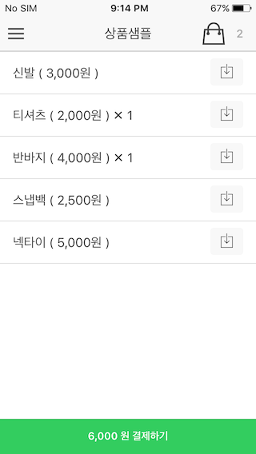

# iamport-ionic-example
Iamport 결제모듈 연동을 위한 Ionic 플러그인 사용법을 설명하는 샘플 프로젝트입니다.  
[Iamport Ionic 플러그인](https://github.com/iamport/iamport-ionic)

## 1. ionic 프로젝트 시작  
ionic start **project_name** sidemenu

## 2. iamport ionic 플러그인 설치  
cordova plugin add https://github.com/iamport/iamport-ionic --variable URL_SCHEME=**ioniciamport**  

iamport ionic 플러그인을 설치함으로써 inAppBrowser 플러그인, Custom URL Scheme 플러그인도 같이 설치됩니다.  

## 3. 샘플 프로젝트처럼 소스 수정
제공되는 소스코드 중 다음을 확인하여 신규로 생성된 프로젝트에 적용합니다.(www폴더 내)  

- index.html (ng-cordova-iamport.js 선언 추가해줘야 함)
- products.html
- menu.html
- app.js
- controllers.js

## 4. ionic build *platform*
platform별로 build 프로세스를 진행합니다. 